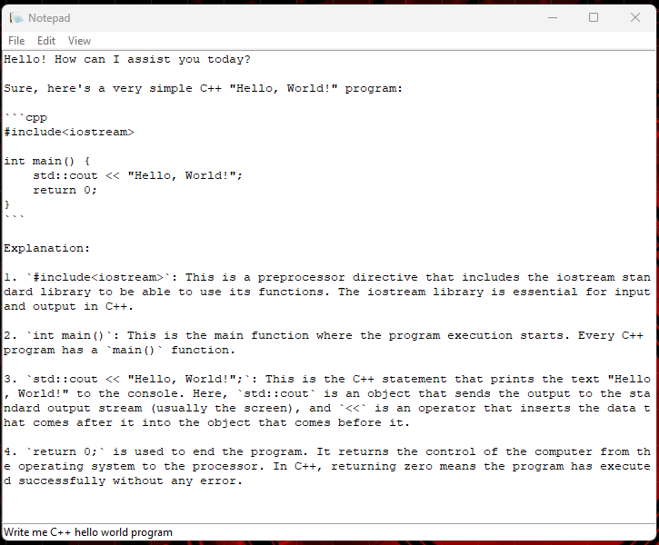

# Chatpad
GPT-4 Powered Chat App Disguised as Windows Notepad

## Features

- **Classic Notepad Interface:** Users can enjoy the familiar layout of Windows Notepad, making the application easy and intuitive to use.
- **GPT-4 Integration:** The app is powered by OpenAI's GPT-4, offering advanced natural language processing capabilities for a variety of tasks.
- **Real-Time Interaction:** Users can send messages to the GPT-4 model and receive responses in real-time, directly within the Notepad interface.
- **File Management:** Standard Notepad functions like opening, editing, and saving text files are maintained, offering a seamless experience.

## Installation

1. **Prerequisites:**
   - Python installed on your system.
   - `tkinter` library for the GUI.
   - OpenAI's Python library for GPT-4 integration.

2. **Setting Up:**
   - Clone or download the repository to your local machine.
   - Install the required Python libraries.
   - Obtain an API key from OpenAI and add it to the code.

## Usage

- **Starting the App:** Run the script to open the Notepad interface.
- **Interacting with GPT-4:** Type your message in the entry field and press Enter. The GPT-4 response will appear in the main text area.
- **File Operations:** Use the File menu to create, open, and save text files.

## Contributing

Contributions to the project are welcome. Please follow the standard GitHub pull request process.

## License

This project is licensed under the MIT License.

## Disclaimer

This app is a demonstration of integrating OpenAI's GPT-4 into a desktop application and is intended for educational and experimental purposes only.

## Contact

For any queries or suggestions, please reach out to Pi Ko at pk2269@nyu.edu.

